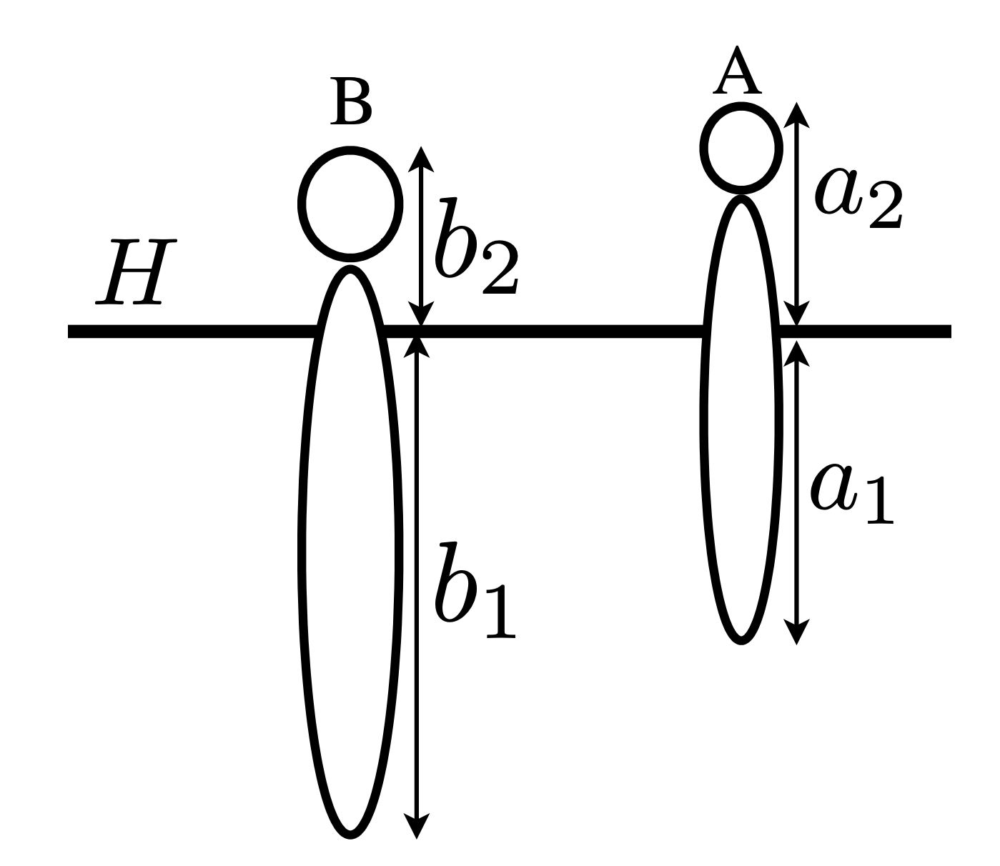
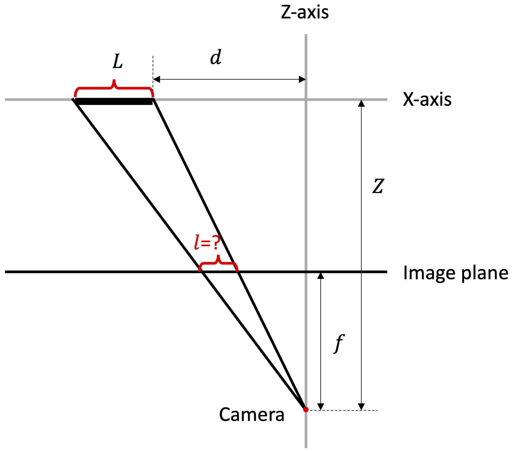
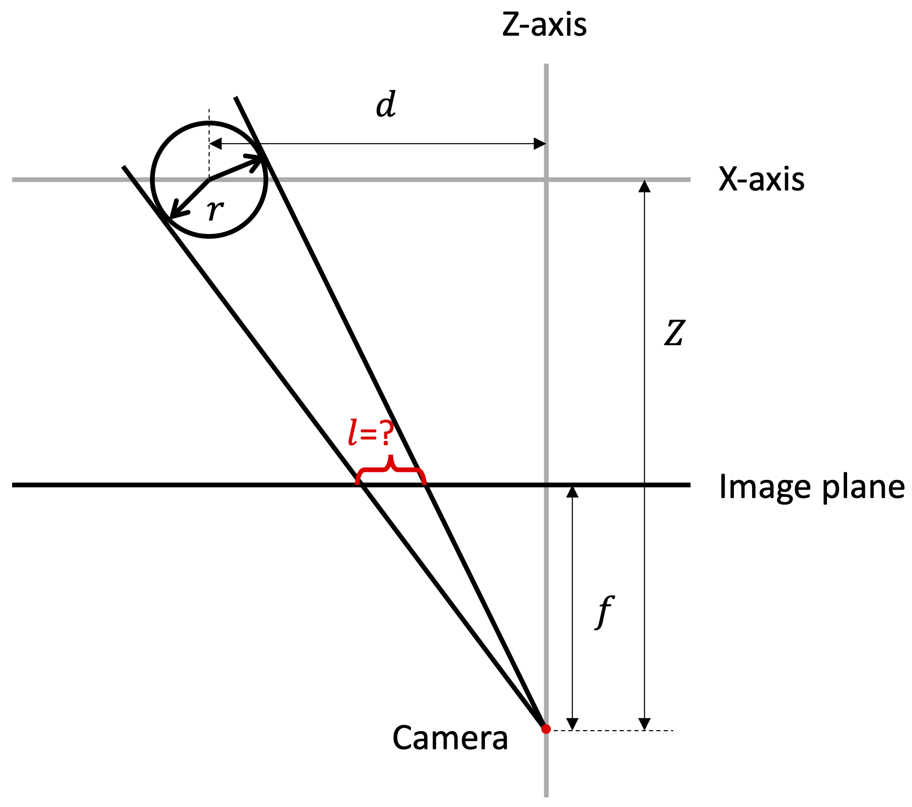
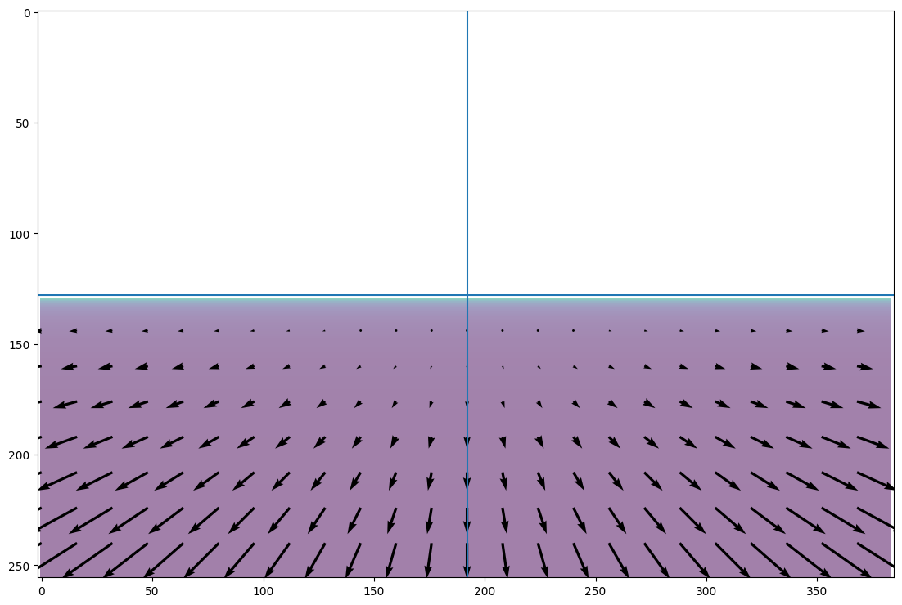
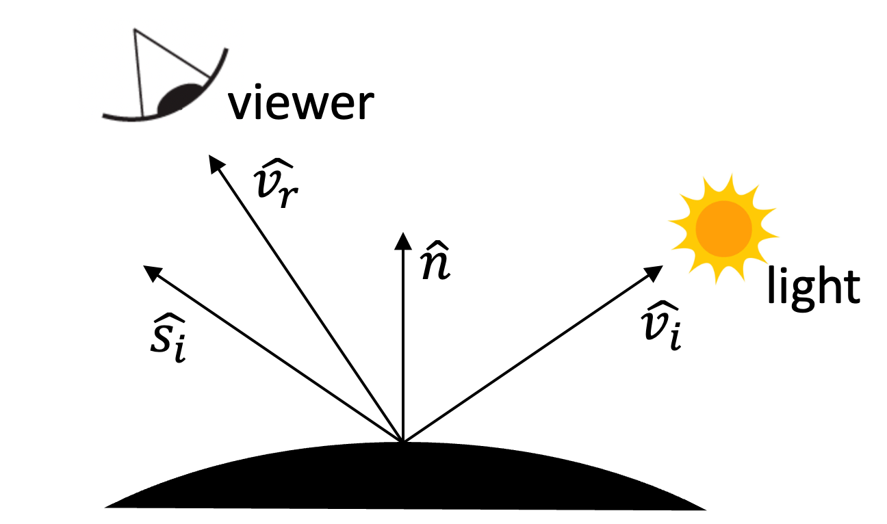
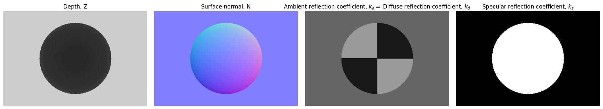

## ECE549 / CS543 Computer Vision, Spring 2023, Assignment 1

### Instructions

1.  Assignment is due at **11:59:59 PM on Wednesday Feb 15, 2023**.

2.  See [policies](http://saurabhg.web.illinois.edu/teaching/ece549/sp2023/policies.html)
    on [class website](http://saurabhg.web.illinois.edu/teaching/ece549/sp2023/).

3.  Submission instructions:

    1.  A single `.pdf` report that contains your work for Q1, Q2, and Q3.  You
        can either type out your responses in LaTeX, or any other word processing
        software.  You can also type your work in Markdown using the template file
        in `README.md`. In that case, please enter your work under the `Answer:`
        section of each problem.  You can also hand write them on a tablet, or scan
        in hand-written answers. If you hand-write, please make sure they are neat
        and legible.  If you are scanning, make sure that the scans are legible.
        Lastly, convert your work into a `PDF`.

        PDF file should be submitted to [Gradescope](https://www.gradescope.com)
        under `MP1`. Course code is **3J2KWY**. Please make sure you tag the
        reponses in your PDF with the Gradescope questions outline as described in
        [Submitting an Assignment](https://youtu.be/u-pK4GzpId0).  

    2.  For Q4 we are using **gradescope autograder** for testing your code.
    For this to work, you will need to submit the code according to the
    following instructions:
        - Code should be submitted to [Gradescope](https://www.gradescope.com)
        under `MP1-code`, you will need to submit the *python* file: `render_image.py`.
        - Do not compress the files into `.zip` as this will not work.
        - Do not change the provided files names nor the names of the functions but
        rather change the code inside the provided functions and add new functions.
        Also, make sure that the inputs and outputs of the provided functions are
        not changed.
        - The autograder will give you feedback on how well your code did.
        - The autograder is configured with the following python libraries only: 
            - numpy
            - matplotlib
    
    3. You will also submit code for Q3. Include it as `.py` files in the code
       you upload to `MP1-code`. This code won't be autograded but failure to
       include this code will lead to zero credit on Q3.

    4.  We reserve the right to take off points for not following
        submission instructions. In particular, please tag the responses in your
        PDF with the Gradescope questions outline as described in
        [Submitting an Assignment](https://youtu.be/u-pK4GzpId0)).

4.  Lastly, be careful not to work of a public fork of this repo. Make a
    private clone to work on your assignment. You are responsible for
    preventing other students from copying your work. Please also see point 2
    above.


### Problems

1. **Comparing Heights [7 pts]**

   Consider the image of person A and person B standing on the ground plane as
   captured by a perspective camera of focal length $f$. $H$ is the horizon
   line ($y=0$). $a_1$ is the distance between A's toes and the horizon, and
   $a_2$ is the distance between A's head and the horizon in the unit of
   pixels. Similarly for the person B. Suppose A's height is $h$ feet.
   
   <div align="center">
   <br/>
   <br/>
   
   <br/>
   <br/>
   </div>
      
   1. **[1 pt]** From the picture, is it possible to determine who is taller in the real world? If so, who is taller A or B? Show your work.
   
       *Answer*:
   
   2. **[6 pts]** Give expressions for the following quantities in terms of $f, a_1, a_2, b_1, b_2, h$. Show your work.
   
       1. **[2 pts]** How many feet above the ground is the camera?
   
          *Answer*:
   
       2. **[2 pts]** What is the height of person B in feet? 
       
          *Answer*:
       
       3. **[2 pts]** Distance (along z-axis) from the camera to person B (in feet)?
       
          *Answer*:
   
   
   
2. **Rectangle and Cylinder under Perspective Projection [12 pts]**
   
   1.  **[4 pts]** Suppose a rectangle of width $L$ is moving along the X axis.
   How does its width $l$ on the image plan change _w.r.t._ its distance $d$ to
   the origin? Recall that, under perspective projection a point $(X,Y,Z)$ in
   3D space maps to $(f\frac{X}{Z}, f\frac{Y}{Z})$ in the image, where $f$ is
   the distance of the image plane from the pinhole.
   
       <div align="center">
       
       </div>
   
       *Answer*:

   2. **[8 pts]** What if we replace the rectangle with a cylinder of radius
   $r$ on the X axis, how does its width $l$ on the image plane change _w.r.t._
   its distance $d$ to the origin? Show your work, and try to simplify the
   final result as much as possible. We won't take points off if your answer is
   correct and complete, but is only missing algebraic simplifications.
   
       <div align="center">
       
       </div>
       
       *Answer*:

3. **Dynamic Perspective [8 pts]**. In this question, we will simulate optical flow induced on the image of a static scene due to camera motion.
You can review these concepts from [lecture 5](http://saurabhg.web.illinois.edu/teaching/ece549/sp2023/slides/lec05_dynamic_perspective.pdf). For this problem (including both 3.1 and 3.2), you can assume that the X-axis points to the right, Y-axis points down and Z-axis points into the scene.

    1. **[4 pts]** Assuming a camera moving with translation velocity of $t$ and angular velocity of $\omega$. Derive the equation that governs the
    optical flow at a pixel $(x, y)$ in terms of the focal length $f$, and the depth of the point $Z(x, y)$. Note that a point $(X, Y, Z)$ 
    in the world projects to $(f\frac{X}{Z}, f\frac{Y}{Z})$ in the image.
    
       *Answer*:
    
    2. **[4 pts]** Next, we will try to visualize the optical flow induced on
    the image of a static scene due to camera motion. We will build off
    starter code in [dynamic_perspective_starter.py](./q3/dynamic_perspective_starter.py).
    We have implemented two simple scenes, that of a vertical wall directly
    in front of the camera (`get_wall_z_image`), and that of a camera overlooking
    a horizontal plane (`get_road_z_image`). Your task is to use these scenes
    to visualize the induced optical flow for the following situations:
    
        1. Looking forward on a horizontal plane while driving on a flat road.
        2. Sitting in a train and looking out over a flat field from a side window.
        3. Flying into a wall head-on.
        4. Flying into a wall but also translating horizontally, and vertically.
        5. Rotating in front of a wall about the Y-axis.
    
       You should pick the appropriate scene, $t$ and $w$, and visualize the
    induced optical flow (you can use the `plot_optical_flow` function).  Note
    that the origin (for the perspective projection equations) is at the center
    of the camera, and this is different from the origin for images in numpy.
    As an example, we have provided the output for the first case. 
    
       1. Looking forward on a horizontal plane while driving on a flat road.
           <div align="center">
           
           </div>
       
       Include the generated optical flow for the remaining cases below.
       
       2. **[1 pts]** Sitting in a train and looking out over a flat field from a side window.
       
          *Answer*:
       
       3. **[1 pts]** Flying into a wall head-on.
       
          *Answer*:
       
       4. **[1 pts]** Flying into a wall but also translating horizontally, and vertically.
       
          *Answer*:
       
       5. **[1 pts]** Rotating in front of a wall about the Y-axis.
       
          *Answer*:

4. **Phong Shading Model [16 pts]**. In this problem, we will take a closer
    look at different types of surfaces and their appearance under varying
    lighting and viewing conditions. We will work with the 
    ambient + lambertian + specular model for image formation (see Section 2.2,
    Equation 2.94 in [Szeliski](https://szeliski.org/Book/). In particular,
    we will work with the following equation for the intensity at a given pixel $x$, 
    ```math
    I(x) =  \text{Ambient Term} + \text{Diffuse Term} + \text{Specular Term} \\
    I(x) = k_a L_a + k_d \sum_i L_i [\hat{v}_i \cdot \hat{n}]^{+} + k_s \sum_i L_i ([\hat{v}_r \cdot \hat{s}_i]^{+})^{k_e}
    ```

    Here,
    - The ambient term, is simply the ambient reflection coefficient, $k_a$, times the ambient light, $L_a$.
    - The diffuse term, assumes that the surface is lambertian, that is, it reflects incoming light, $L_i$ multiplied by the diffuse reflection coefficient $k_d$, equally in all directions. However, we need to pay attention to the amount of light that is coming in.  It depends on the angle at which light is incident onto the surface. It is given by the dot product $\hat{v}_i \cdot \hat{n}$ between the surface normal at the point $\hat{n}$, and the direction from which light is incident $\hat{v}_i$. $[\cdot]^{+}$ denotes the $\max$ with $0$.
    - For the specular term, the light gets reflected preferentially in directions close to the actual direction of reflection. In particular, we will use a dependence of the form $([\hat{v}_r \cdot \hat{s}_i]^{+})^{k_e}$, where $\hat{s}_i$ is the direction of reflection, $\hat{v}_r$ is the viewing direction, and $k_e$ is the shininess coefficient.
    - Vectors $\hat{n}$, $\hat{v}_i$, $\hat{v}_r$ and $\hat{s}_i$ are illustrated below for reference 
        <div align="center">
        
        </div>
    - We are going to ignore shadows and inter-reflections: 
        - As long as the surface is facing the light source, we will assume that the surface will receive light from the light source.
        - A surface only receives light directly from the point / directional light sources, or the ambient light.
    - Lastly, we are also going to ignore the $1/r^2$ attenuation for point light sources.
    
    As part of this problem, we will simulate these three terms and use it to render a simple scene. We will provide the per-pixel scene depth, surface normal, and the different coefficients $k_a$, $k_d (=k_a)$ and $k_s$; as well as the strength and locations of the various lights in the scene. Your task is to compute the image based on this information using the Phong Shading model described above.
    
    We have provided a scene with a sphere in front of a wall. You can access this scene using the `get_ball` function from the file  [generate_scene.py](./q4/generate_scene.py). It returns the per-pixel depth, surface normal and $k_a$, $k_d$ and $k_s$ for the scene, as visualized below (you can assume a reasonable value for $k_e$ (say 50)):
        <div align="center">
        
        </div>
    
    We have also provided some starter code in  [render_image.py](./q4/render_image.py) that sets up the different test cases (positions of lights). Your task is to fill in the `render` function that implements the Phong shading model as described above. An example rendering that your code will produce is shown below.
        <div align="center">
        
        </div>
    


