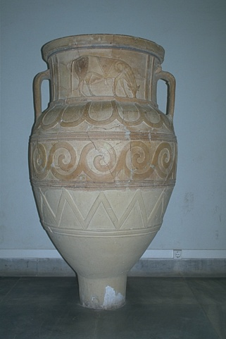

## Contour Detection - Solution Template

**NOTE:** All values and figures in this template are examples that you will need to replace with your own results

1. **Method Description.** *TODO*: Describe the different methods and their key implementation detials.
For Part 1(Warm-up), to reduce the image, at first I tried padding the image on its left, right, up, down directions. In other words, add a one-pixel border to the image. The convolution will have larger overlap area with the images, which will reduce the artifacts of the image boudaries. However, this will lead to incorrespondance of the result image's size. For an alternative methods, I just change the boundary parameter of signal.convolve2d to "symmetric", this reduced a certain amount of the boudary because it extends the image size. Then I used the gaussian_filter from scipy.ndimage to achieve the gaussian filter, start from 1, I tried sigma = 2, sigma = 3. From 1 to 2, the performance increased, and from 2 to 3, the performance decreased. I picked 2 as the sigma for the Gaussian smoothing. For the non-maximum suppression, I first calculate the angle (in radians) between the positive x-axis and the point (x, y) in the xy-plane with np.arctan2(). Then I continue to determine the direction of the edge at each pixel based on its gradient direction angle. This is done by comparing the gradient angle to a set of predefined threshold values, which correspond to four different edge directions: horizontal, vertical, and two diagonal directions, which is a common methods for NMS.
2. **Precision Recall Plot.** *TODO*: Use [contour_plot.py](contours/../contour_plot.py) to add curves for the different methods that you implemented into a single plot.
   
   

      
   

3. **Results Table.** *TODO*: Present the performance metrics for each implementation part on the val set in a table format

   | Method | overall max F-score | average max F-score | AP | Runtime (seconds) |
   | ----------- | --- | --- | ---  | --- |
   | Initial implementation | 0.404 | 0.460 | 0.315 | 0.006 |
   | Warm-up [remove boundary artifacts] | | | | |
   | Smoothing | | | | |
   | Non-maximum Suppression | | | | 
   | Val set numbers of best model [From gradescope] | | | |

4. **Visualizations.** *TODO:* Include visualization on 3 images from val set showing the impact of your implementation for each part. Describe the effect of your implementation for each part on these images by pointing to relevant image regions. Comment on where does your code work well, where it doesn't and why? You may also add visualizations of your own images. Here is how you can lay out images in markdown.
   

      
      
      
   

5. **Bells and Whistles.** *TODO*: Include details of the bells and whistles that you
   tried here.

   *TODO*: Present the performance metrics for the bells and whistles in a table format
   
   | Method | overall max F-score | average max F-score | AP | Runtime (seconds) |
   | ----------- | --- | --- | ---  | --- |
   | Best base Implementation (from above) | | | | 
   | Bells and whistle (1) [extra credit]) | | | | 
   | Bells and whistle (2) [extra credit]) | | | |
   | Bells and whistle (n) [extra credit]) | | | |
